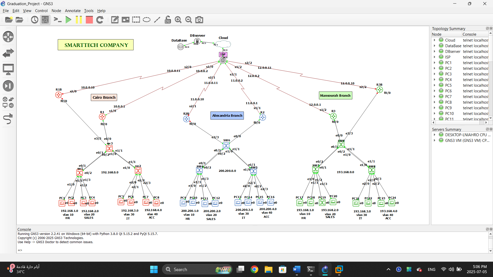

# Secure Multi-Branch Network for SmartTech — Design & Implementation

**Design and Implementation of a Secure Multi-Branch Network for SmartTech Using VPN and Cloud Integration**
Graduation Project, 2025 — Simulated on **GNS3**

## Project Objective

Design and simulate a secure, redundant, and scalable enterprise network for a company (SmartTech) with three branch offices — **Cairo, Alexandria, and Mansoura** — connected through a centralized ISP router. Each branch includes routers and switches configured for VLANs, DHCP, ACLs, VRRP, GRE tunnels, and OSPF, ensuring interconnectivity, internet access, redundancy, and department segmentation.

## Network Design Overview

- **Three branches**: Cairo (R1), Alexandria (R2), Mansoura (R3)
- **ISP & Core Router**: centralized ISP router (R4) connecting all branches via static routing
- **Internal redundancy**: VRRP between paired routers (R5, R6, R7) for high availability

## Key Features Implemented

| Area | Technologies / Concepts |
|---|---|
| Routing & Switching | OSPF, Static Routing, Router-on-a-Stick, VLANs, 802.1Q Trunking, EtherChannel (LACP/PAgP) |
| High Availability | VRRP (redundant default gateway) |
| VPN & Tunneling | GRE tunnels between branches, NAT/PAT |
| Security | Extended ACLs (inter-VLAN traffic filtering), Port Security, DHCP Snooping, SSH remote access |
| Cloud Integration | AWS account setup with MFA, IAM groups/users, EC2 instance, remote-accessible MySQL server |

## Repository Contents

- `docs/` — Full configuration documentation and Standard Operating Procedures (SOPs):
  - Router & switch configuration (VLANs, OSPF, GRE, VRRP, ACLs, security)
  - AWS cloud setup (account, MFA, IAM, EC2)
  - MySQL remote server configuration
- `images/` — Network topology diagrams and configuration screenshots

## Tools Used

- **GNS3** — network simulation
- **AWS** — cloud infrastructure (EC2, IAM)
- **MySQL / Ubuntu Server** — remote database configuration

## About This Project

This project was completed independently as part of a Communications and Electronics Engineering graduation project, covering the full network design and configuration lifecycle from planning through security hardening and cloud integration.
